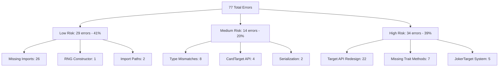
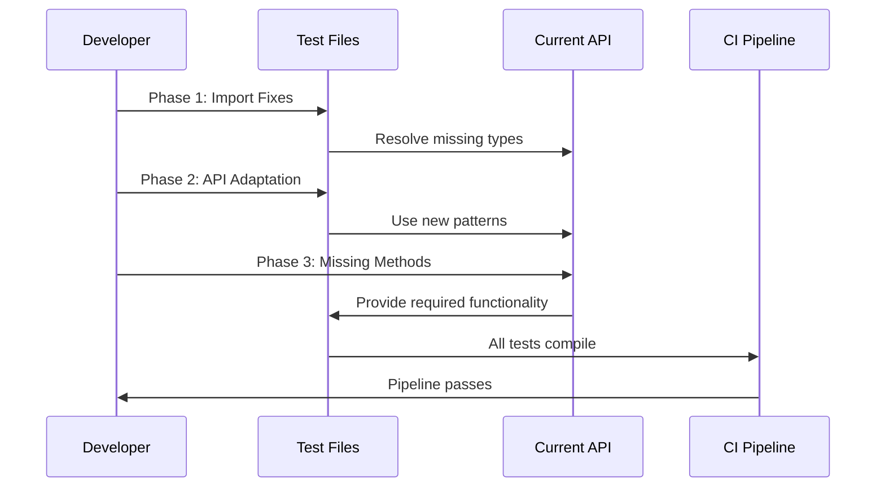
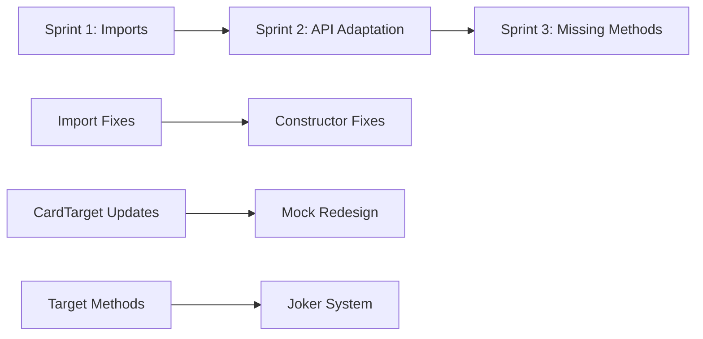

# Test Compilation Fixes Technical Specification

## Executive Summary

This specification addresses the systematic resolution of 77 compilation errors across 6 test files in the balatro-rs project, preventing CI from passing. The errors range from simple import fixes to complex API redesigns, requiring a phased approach to minimize risk and ensure thorough testing.

## Problem Statement

PR #479 "Fix CI compilation errors at HEAD main" successfully resolved build compilation and clippy/rustfmt issues, but test compilation remains blocked due to API evolution that has made test code incompatible with the current implementation.

**Current Status:**
- ✅ Core library builds successfully
- ✅ Clippy and rustfmt pass
- ❌ Test suite fails with 77 compilation errors
- ❌ CI pipeline blocked

## Requirements Analysis

### Functional Requirements

1. **Complete Test Compilation**: All test files must compile without errors
2. **Test Coverage Preservation**: Existing test logic must be preserved where possible
3. **API Compatibility**: Tests must use current API patterns consistently
4. **CI Pipeline Restoration**: Full CI pipeline must pass including test execution

### Non-Functional Requirements

1. **Maintainability**: Solutions must be sustainable and follow current codebase patterns
2. **Risk Minimization**: Changes must not break existing working functionality
3. **Development Velocity**: Fixes must be efficiently implementable in planned sprint structure
4. **Code Quality**: All fixes must meet clippy and rustfmt standards

## Error Analysis Breakdown

### Total Error Count: 77 Compilation Errors
**Affected Files:**
- `consumable_trait_test.rs` (37 errors) 
- `combination_generation_test.rs` (14 errors)
- `target_validation_test.rs` (12 errors)
- `joker_targeting_test.rs` (9 errors)
- `scaling_joker_tests.rs` (3 errors)
- `security_tests.rs` (2 errors)

## Architecture Overview

### Error Categories and Complexity Matrix



### Technical Architecture

#### Current API vs Test Expectations

**Working API Components:**
- ✅ `Target` enum with all variants (`Cards`, `HandType`, `Joker`, `Deck`, `Shop`)
- ✅ `CardTarget` struct with validation
- ✅ `Consumable` trait definition
- ✅ Basic target creation methods (`cards_in_hand`, `cards_in_deck`, etc.)

**Missing API Components:**
- ❌ `Target::get_available_targets()` static method
- ❌ `JokerTarget` struct and `JokerTargetError` enum
- ❌ Test utility methods (`get_mock_id`, `get_real_id`)
- ❌ Enhanced joker targeting methods (`joker_at_slot`, `active_joker_at_slot`)

#### Data Flow for Test Fixes



## Implementation Plan

### Sprint Breakdown (3 Sprints, 2 weeks each)

#### Sprint 1: Foundation Fixes (Low Risk Items)
**Goal:** Resolve all mechanical import and constructor issues
**Duration:** 1 week
**Story Points:** 8

**Issues to Address:**
1. Add missing `ConsumableId` imports across all test files
2. Fix `GameRng::new()` constructor calls to include `RngMode` parameter
3. Update import paths from `crate::rng` to `balatro_rs::rng`
4. Fix `Stage` constructor usage in tests

**Acceptance Criteria:**
- All import errors resolved
- All constructor errors resolved  
- No regression in existing working tests
- Clippy and rustfmt still pass

#### Sprint 2: API Adaptation (Medium Risk Items)
**Goal:** Update test code to use current API patterns
**Duration:** 1.5 weeks
**Story Points:** 13

**Issues to Address:**
1. Update `CardTarget` usage to new API methods
2. Implement missing serialization traits where needed
3. Redesign mock consumables without deprecated methods
4. Fix type mismatches in stage and target usage

**Acceptance Criteria:**
- All CardTarget errors resolved
- Mock objects work with current trait definitions
- Type safety maintained throughout
- Test logic preserved where possible

#### Sprint 3: Missing API Implementation (High Risk Items)
**Goal:** Implement or provide alternatives for missing API methods
**Duration:** 2 weeks  
**Story Points:** 21

**Issues to Address:**
1. Implement `Target::get_available_targets()` or equivalent functionality
2. Create `JokerTarget` system for enhanced joker validation
3. Add missing joker targeting methods to `Target` enum
4. Redesign target enumeration logic in combination tests

**Acceptance Criteria:**
- All test files compile successfully
- Target enumeration functionality restored
- Joker targeting works as expected in tests
- Complete CI pipeline passes

## Risk Assessment and Mitigation

### High Risk Items

#### 1. Target API Redesign (22 errors)
**Risk:** Tests expect `get_available_targets()` method that doesn't exist
**Impact:** High - blocks multiple core test files
**Mitigation:** 
- Analyze test usage patterns to understand expected behavior
- Implement equivalent functionality using current API patterns
- Create adapter methods if needed for backward compatibility
**Rollback:** Maintain test functionality through alternative implementation

#### 2. Missing Trait Methods (7 errors)
**Risk:** Test infrastructure relies on removed methods (`get_mock_id`, `get_real_id`)
**Impact:** Medium - affects test utilities but not core functionality  
**Mitigation:**
- Create alternative test helper functions
- Use trait objects or other patterns for test identification
- Document new testing patterns for future use
**Rollback:** Fallback to simpler test patterns without unique identification

### Medium Risk Items

#### 3. CardTarget API Changes (4 errors)
**Risk:** Tests use array indexing and length operations not supported by new API
**Impact:** Medium - localized to specific test patterns
**Mitigation:**
- Use new CardTarget methods for accessing card data
- Update test patterns to use supported operations
- Ensure equivalent test coverage maintained
**Rollback:** Simple reversion to alternative access patterns

### Performance Impact Analysis

**Baseline Performance:** Current compilation time ~45 seconds for core library
**Expected Impact:** 
- Import fixes: No performance impact
- API updates: Minimal impact, better type safety
- Missing method implementation: Slight increase in binary size

**Load Testing Requirements:** No additional load testing needed - changes are test-only

### Scalability Considerations

**Horizontal Scaling:** Changes are development-time only, no runtime impact
**Caching Strategy:** No caching implications
**Database Impact:** No database changes required

### Rollback Strategy

#### Component-Level Rollback Procedures

1. **Import Fixes:** Simple git revert of import changes
2. **API Adaptation:** Rollback to previous test patterns if new API proves insufficient  
3. **Missing Methods:** Feature flags for new methods if implementation proves problematic

#### Database Migration Rollback
Not applicable - no database changes

#### Feature Toggle Implementation
```rust
#[cfg(feature = "enhanced_targeting")]
impl Target {
    pub fn get_available_targets(target_type: TargetType, game: &Game) -> Vec<Target> {
        // Implementation
    }
}
```

#### Gradual Rollout Plan
1. Fix imports first (safe, reversible)
2. Test API adaptation on single file
3. Implement missing methods incrementally with feature flags

## Success Metrics

### Key Performance Indicators

1. **Compilation Success Rate:** 100% (currently 0% for tests)
2. **CI Pipeline Pass Rate:** 100% (currently ~60% due to test failures)
3. **Test Coverage Maintenance:** ≥95% of original test coverage preserved
4. **Development Velocity:** Sprint completion within planned timeframes

### Acceptance Criteria

#### Sprint 1 Success Criteria
- [ ] All 26 import errors resolved
- [ ] All 3 constructor errors resolved
- [ ] Clippy and rustfmt still pass
- [ ] No regression in compilation of core library

#### Sprint 2 Success Criteria  
- [ ] All CardTarget usage updated to new API
- [ ] Mock objects work with current trait system
- [ ] All type mismatches resolved
- [ ] Test logic equivalent to original where possible

#### Sprint 3 Success Criteria
- [ ] All 77 compilation errors resolved
- [ ] Full test suite compiles and runs
- [ ] CI pipeline passes completely
- [ ] Test coverage metrics restored

### Testing Requirements

#### Unit Testing Strategy
- Each fix category tested independently
- Regression testing after each sprint
- Mock object validation for trait changes

#### Integration Testing
- Full CI pipeline execution after each sprint
- Cross-platform testing (Ubuntu, macOS, Windows)
- Performance regression testing

#### Test Coverage Goals
- Maintain existing test coverage levels
- Add tests for newly implemented methods
- Ensure test quality meets project standards

## Implementation Dependencies

### Sprint Dependencies


### Technical Dependencies
- Rust toolchain compatibility
- Understanding of current API design philosophy
- Access to original API documentation or design decisions

### Resource Dependencies
- Developer with Rust expertise
- Access to CI/CD pipeline for testing
- Code review capacity for complex API changes

## Conclusion

This specification provides a systematic approach to resolving the 77 test compilation errors blocking CI. The phased approach minimizes risk while ensuring comprehensive resolution of all issues. The high proportion of low-risk fixes (41%) provides early wins, while the complex API redesign work is isolated to the final sprint when dependencies are resolved.

**Estimated Total Effort:** 42 story points across 3 sprints
**Risk Level:** Medium to High due to API redesign requirements
**Success Probability:** High with proper sprint execution and stakeholder involvement

**Next Steps:**
1. Review and approve this specification
2. Use `/bugify` command to create GitHub issues from this specification
3. Assign and begin Sprint 1 execution